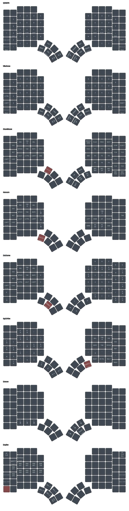

<h3 align="center">
  
  <br />
  ZMK MoErgo Glove80 Configuration ⌨ 💿️
  
</h3>

<p align="center">
  <a href="https://github.com/NikolaM-Dev/glove80-zmk-config/blob/main/LICENSE"></a>
  <a href="https://github.com/NikolaM-Dev/glove80-zmk-config/contributors"></a>
  <a href="https://github.com/NikolaM-Dev/glove80-zmk-config/stargazers"></a>
  <a href="https://github.com/NikolaM-Dev/glove80-zmk-config/issues"></a>
  <a href="https://github.com/NikolaM-Dev/glove80-zmk-config/commits/main/"></a>
</p>

<div align="center">
  <figure>
    
    <br />
    <figcaption>
      <i>
        Created with
        <a href="https://github.com/caksoylar/keymap-drawer" target="_blank">
          caksoylar/keymap-drawer
        </a>
      </i>
    </figcaption>
  </figure>
</div>

&nbsp;

<details><summary>👉 Table of Contents</summary>

- [📍 Overview](#-overview)
- [✨ Features](#-features)
- [⛅ Behind The Code](#-behind-the-code)
  - [🌈 Inspiration](#-inspiration)
  - [💡 Challenges / Learnings](#-challenges--learnings)
- [⚡ Quick Start](#-quick-start)
  - [🏕️ Run Locally](#️-run-locally)
  - [🛣️️ ROADMAP](#️️-roadmap)
- [🫂 Acknowledgments](#-acknowledgments)

</details>

## 📍 Overview

> Short Sweet Headline 🎇🎉

`<project-description>`

## ✨ Features

- **Feature 1** – `<feature-description>`
- **Feature 2** – `<feature-description>`
- **Feature 3** – `<feature-description>`

## ⛅ Behind The Code

### 🌈 Inspiration

`<project-inspiration>`

### 💡 Challenges / Learnings

- `<what-you-learned>`
- `<what-challenge-you>`

## ⚡ Quick Start

### 🏕️ Run Locally

```bash
git clone https://github.com/NikolaM-Dev/glove80-zmk-config.git
cd glove80-zmk-config
```

### 🛣️️ ROADMAP

See the [ROADMAP](./ROADMAP.md) for upcoming features, feel free to fork,
tweak, or open an issue if you spot a bug or want to collaborate.

## 🫂 Acknowledgments

- [2KAbhishek/bare-minimum: Minimalist template repository. ✨🛠](https://github.com/2KAbhishek/bare-minimum)
  – project inspiration.
- [catppuccin/catppuccin: 😸 Soothing pastel theme for the high-spirited!](https://github.com/catppuccin/catppuccin)
  – for the README assets.
- [Showcase - Tailwind CSS](https://tailwindcss.com/showcase) – for the preview
  image.
- [eli64s/readme-ai: README file generator, powered by AI.](https://github.com/eli64s/readme-ai)
  – for the Table of Contents summary.

&nbsp;

<p align="center"></p>

<p align="center">⭐ Hit the Star Button if You Found This Useful ⭐</p>
<p align="center">
  <a href="https://x.com/nikolam_dev" target="_blank"></a>
  <a href="https://www.linkedin.com/in/nikolam-dev" target="_blank"></a>
  <a href="https://github.com/NikolaM-Dev" target="_blank"></a>
  <a href="#readme" target="_blank"></a>
</p>

```md
# MoErgo Glove80 Custom Configuration for ZMK


This repo is the official ZMK configuration of the MoErgo Glove80 wireless split contoured keyboard. Use it to develop your own keymap and easily build your own ZMK firmware to run on your Glove80.

**NOTE: You can also customize the layout of your Glove80 keyboard with the Glove80 Layout Editor webapp. For most users Glove80 Layout Editor is the recommended and simpler option. More information is available at the official MoErgo Glove80 Support site (see resources below).**

These steps will get you using your keymap on your keyboard in the fastest time possible. It uses the GitHub Actions feature to build your firmware online.

If you are looking to dig deeper into ZMK and develop new functionality, it is recommended to follow the steps of installing ZMK as found on the official ZMK documentation site (linked below).

## Resources

- The [official MoErgo Glove80 Support](https://moergo.com/glove80-support) web site. Glove80 documentation and other technical resources.
- The [official MoErgo Discord Server](https://moergo.com/discord). Instant conversations with other Glove80 users.

- The [official ZMK Documentation](https://zmk.dev/docs) web site. Find the answers to many of your questions about ZMK Firmware.
- The [official ZMK Discord Server](https://discord.gg/8cfMkQksSB). Instant conversations with other ZMK developers and users. Great technical resource!

- The [official Glove80 ZMK Distribution](https://github.com/moergo-sc/zmk). Repositiory for ZMK firmware customized for Glove80.

## Instructions

1. Log into, or sign up for, your personal GitHub account.
2. Create your own repository using this repository as a template ([instructions](https://docs.github.com/en/repositories/creating-and-managing-repositories/creating-a-repository-from-a-template)) and check it out on your local computer.
3. Edit the keymap file(s) to suit your needs
4. Commit and push your changes to your personal repo. Upon pushing it, GitHub Actions will start building a new version of your firmware with the updated keymap.

## Firmware Files

To locate your firmware files and reflash your Glove80...

1. log into GitHub and navigate to your personal config repository you just uploaded your keymap changes to.
2. Click "Actions" in the main navigation, and in the left navigation click the "Build" link.
3. Select the desired workflow run in the centre area of the page (based on date and time of the build you wish to use). You can also start a new build from this page by clicking the "Run workflow" button.
4. After clicking the desired workflow run, you should be presented with a section at the bottom of the page called "Artifacts". This section contains the results of your build, in a file called "glove80.uf2"
5. Download the glove80.uf2
6. Flash the firmware to Glove80 according to the user documentation on the official Glove80 Glove80 Support website (linked above)

Your keyboard is now ready to use.
```
